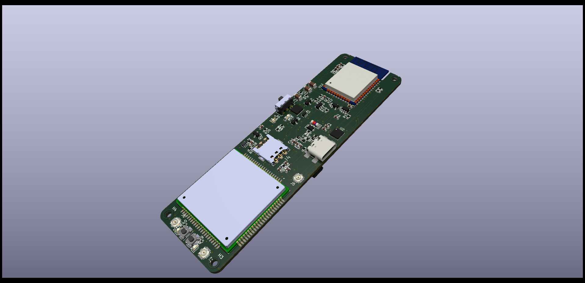
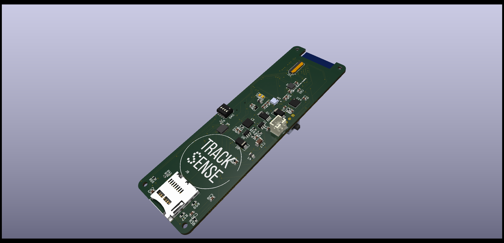

# TrackSense PCB

## Un protoype expérimental pour le projet [TrackSense](https://github.com/DFC-Informatique-Cegep-de-Sainte-Foy/TrackSense)

**:warning: Avertissement: ce design n'a pa été ni contruit ni testé. Ce dépôt n'offre aucune garantie quant au fonctionnement du prototype. Procédez à la fabrication à vos risques.**

Créé avec le logiciel open source gratuit [KiCad V8.0.0](https://gitlab.com/kicad)

